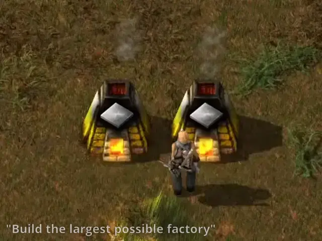
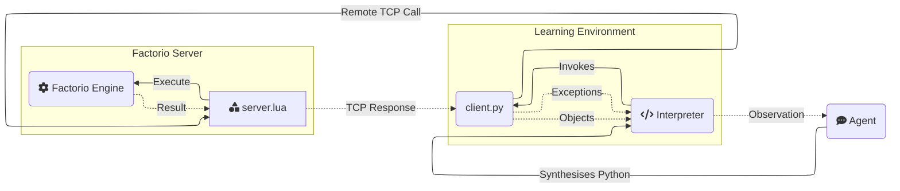

<h1 align="center">Factorio Learning Environment</h1>

<p align="center">
Codebase for Neurips 2025 Datasets and Benchmarks submission of "Factorio Learning Environment". An open source framework for developing and evaluating LLM agents in the game of <a href="https://factorio.com/">Factorio</a>.
</p>

<p align="center">


</p>
<p align="center"><em>Claude 3.5 plays Factorio</em></p>


## Why FLE?

[//]: # (FLE is a framework that tests agent capabilities in long-term planning, program synthesis, and resource optimization against a set of exponentially scaling challenges, ranging from basic automation to complex factories processing millions of resources per second. )

We provide two settings:
1. **Lab-play**: Structured tasks with fixed resources.
2. **Open-play** An unbounded task of building the largest possible factory on a procedurally generated map. 

Our results demonstrate that models still lack strong spatial reasoning. In lab-play, we find that while LLMs
exhibit promising short-horizon skills, they are unable to operate effectively in constrained environments, reflecting limitations in error analysis. In open-play, while LLMs discover automation strategies that improve growth (e.g electric-powered drilling), they fail to achieve complex 
automation (e.g electronic-circuit manufacturing). 

## Quick Links
- [Installation](#installation)
- [Tasks](#task-documentation)
- [Tools](#tool-documentation)
- [Project Structure](#project-structure)
- [Database](#database)

## Installation

### Prerequisites
- [Factorio](https://www.factorio.com/) (version 1.1.110)
- Docker 
- Python 3.10+

### Package Installation

You can install the factorio-learning-environment package directly using pip:

```bash
# Install from PyPI
pip install factorio-learning-environment
```

### Development Installation

For development, install the package in editable mode:

```bash
# Clone the repository
git clone https://github.com/yourusername/factorio-learning-environment.git
cd factorio-learning-environment

# Install in development mode
python prepare_build.py && pip install -e
```

See [BUILD.md](BUILD.md) for detailed build instructions.

### Usage

After installation, you can import the package in your Python code:

```python
import factorio_learning_environment as fle
```

### Quickstart

1. **Clone the repository**:

```
git clone https://github.com/Anon28352/factorio-learning-environment.git
cd factorio-learning-environment
pip install -e .
```

2. **Install dependencies**:
```
pip install psycopg2 lupa
# Install other dependencies if prompted by pip during runtime
```

3. **Set up Factorio client**:
- Purchase Factorio from the [official website](https://www.factorio.com/) or on Steam.
- Downgrade to version 1.1.110:
    - Steam: Right-click Factorio → Properties → Betas → Select 1.1.110
    - **Important**: Make sure to uncheck the Space Age DLC if you have it, as it forces the 2.x branch

4. **Configure Docker permissions** (for Linux users):
If you typically run Docker with sudo, add your user to the docker group:
```bash
sudo usermod -aG docker $USER
newgrp docker
```

5. **Launch FLE Docker server**:
```bash
# Start Docker daemon
sudo systemctl start docker

# Build Docker image
cd cluster/docker
docker build -t factorio .

# Run a single server
cd ../local
docker compose -f docker-compose-1.yml up -d
```
**Note**: Use docker compose (with a space) instead of docker-compose as shown in the command above.

6. **Configure firewall** (if running server on a different machine):

    Open the following ports:
- UDP 34197 (Game connection)
- TCP 27015 (RCON)


7. **Activate server**:
- Open Factorio client
- Navigate to _Multiplayer_
- Connect to `localhost:34197` (default) or your configured address in Docker. 
  - Once connected, you can safely disconnect. This step confirms your Factorio license with the server.

8. **Configure DB**: Create an `.env` file in the root directory, modelled on `.example.env`

First create the .env file. Note that API keys are only required for the respective model providers that will be used to run eval on

```
# model providers
OPENAI_API_KEY=<KEY>
ANTHROPIC_API_KEY=<KEY>
TOGETHER_API_KEY=<KEY>
OPEN_ROUTER_API_KEY=<KEY>

# If using Postgres DB, NOT REQUIRED (See section on Database)
SKILLS_DB_PORT=""
SKILLS_DB_NAME=""
SKILLS_DB_USER=""
SKILLS_DB_PASSWORD=""

# If using SQLite for DB (See section on Database)
SQLITE_DB_FILE = ""

# AWS credentials if wanting to use Cloudformation, NOT REQUIRED
AWS_SECRET_ACCESS_KEY=<KEY>
AWS_ACCESS_KEY_ID=""
AWS_DEFAULT_REGION=""
CLUSTER_NAME=""
```

If you are not using a Postgres DB, you should create an SQLite database file:
```bash
sqlite3 mydatabase.db
```

Create the required tables:
```
CREATE TABLE programs (
    id INTEGER PRIMARY KEY AUTOINCREMENT,
    code TEXT NOT NULL,
    value REAL DEFAULT 0.0,
    visits INTEGER DEFAULT 0,
    parent_id INTEGER,
    state_json TEXT,
    conversation_json TEXT NOT NULL,
    completion_token_usage INTEGER,
    prompt_token_usage INTEGER,
    token_usage INTEGER,
    response TEXT,
    holdout_value REAL,
    raw_reward REAL,
    version INTEGER DEFAULT 1,
    version_description TEXT DEFAULT '',
    model TEXT DEFAULT 'gpt-4o',
    meta TEXT,
    achievements_json TEXT,
    instance INTEGER DEFAULT -1,
    depth REAL DEFAULT 0.0,
    advantage REAL DEFAULT 0.0,
    ticks INTEGER DEFAULT 0,
    created_at DATETIME DEFAULT CURRENT_TIMESTAMP
);
```

And replace the `PostgresDBClient` object at `create_db_client` function in `eval\open\independent_runs\trajectory_runner.py` with the SQLliteDBClient object (see [Database](#database) section).


## Tasks


### Running tasks
The entrypoint to run tasks is `eval\open\independent_runs\run.py` which reads in a run config json file, runs the tasks specified in parallel and saves each generated program with the environment output and task verification result into the database. The location of the run config json is sent in through the `--run_config` inline argument. If no argument is sent, the default run config `eval\open\independent_runs\run_config.json` is used. 

We have created four run configs, one for open-play, one for a single lab-play planning task, one for all lab-play planning tasks in parallel (needs 24 parallel FLE servers running) and one for all spatial tasks in parallel (needs 5 parallel FLE servers running). The open-play config can be found at `eval\open\independent_runs\run_config_example_open_play.json`, single lab-play planning task config can be found at `eval\open\independent_runs\run_config_example_lab_play_planning_single.json`, lab-play config to run all planning tasks in parallel can be found at `eval\open\independent_runs\run_config_example_lab_play_planning_all.json` and the lab-play config to run all spatial tasks in parallel can be found at `eval\open\independent_runs\run_config_example_lab_play_spatial_all.json`. These can be run by 
```
# open-play
python eval\open\independent_runs\run.py --run_config=eval\open\independent_runs\run_config_example_open_play.json

# lab-play single planning
python eval\open\independent_runs\run.py --run_config=eval\open\independent_runs\run_config_example_lab_play_planning_single.json

# lab-play all planning tasks
python eval\open\independent_runs\run.py --run_config=eval\open\independent_runs\run_config_example_lab_play_planning_all.json

# lab-play all spatial tasks
python eval\open\independent_runs\run.py --run_config=eval\open\independent_runs\run_config_example_lab_play_spatial_all.json
```

The run config json is a list of dictionaries specifying the task_json location, model and version (optional). One example to run 3 tasks in parallel

```
[
{"task": "iron_gear_wheel_throughput_16.json",
"model": "gpt-4o-mini-2024-07-18"},
{"task": "plastic_bar_throughput_16.json",
"model": "anthropic/claude-3.5-sonnet-open-router"},
{"task": "open_play.json",
"model": "gpt-4o-mini-2024-07-18"}
]

```


We provide two tasks: 
1. OpenPlayTask - Task for the open-play setting, where the agent plays the game until a specified number of steps is finished. The verify function will always return False
2. ThroughputTask - Task for requiring the agent to build a factory that achieves a specified throughput in the holdout period. The verify function will return True if the holdout period throughput is above the threshold

The task jsons specifies the "task_type" and the "config" parameters. `task_type` specifies the mapping from the json to the task type (the creation of task objects from the json is done in `eval\tasks\task_factory.py`). `config` specifies all required attributes to substantiate the respective task object. Each config must at minimum define the "goal_description", "trajectory_length" and "task_key" parameters.
Examples of task json
```
# Open play task json

{   "task_type": "default",
    "config": {                         
        "goal_description":"- Build the biggest possible factory\n- Maximise automation, efficiency and scale",
        "trajectory_length": 5000,
        "task_key": "open_play"
    }
}
# One example of a throughput task json
{                          
    "task_type": "throughput",
    "config":
        {"goal_description":"Create an automatic iron gear wheel factory that produces 16 iron gear wheel per 60 ingame seconds",
        "throughput_entity":"iron-gear-wheel",
        "quota":16,
        "trajectory_length": 128,
        "holdout_wait_period": 60,
        "pre_holdout_wait_period": 60,
        "task_key": "iron_gear_wheel_throughput_16"}

}
```
Example open play task object can be seen below. The throughput task object can be found here `eval/tasks/throughput_task.py`
```
class OpenPlayTask(TaskABC):
    def __init__(self, trajectory_length, goal_description: str, task_key: str):
        super().__init__(trajectory_length, starting_inventory = {}, goal_description=goal_description, task_key = task_key)
        self.starting_game_state = None
        
    
    def verify(self, score: float, instance: FactorioInstance, step_statistics: Dict) -> TaskResponse:
        return TaskResponse(success = False,
                            meta = {})
            
    def _to_dict(self) -> Dict[str, Any]:
        return {
            "goal_description": self.goal_description,
            "trajectory_length": self.trajectory_length,
            "starting_inventory": self.starting_inventory,
            "initial_state": self.starting_game_state.to_raw() if self.starting_game_state else None,
        }

    def setup_instance(self, instance):
        """Code to provision the task environment"""
        pass
```

## Tool Documentation

Agents interact with the game using _tools_, which represent a narrow API into the game.

### Anatomy of a Tool

Tools live in `env/src/tools`, and are either `admin` tools (non-agent accessible) or `agent` tools (used by the agent).

A tool requires 3 files:
1. `agent.md`: The agent documentation for the tool, including usage patterns, best practices and failure modes.
2. `client.py`: The client-side implementation, which is a Python class that can be invoked by the agent.
3. `server.lua`: The server-side implementation, which handles most of the logic and heavy lifting. 





### Core Tools

| Tool | Description                                      | Key Features |
|------|--------------------------------------------------|--------------|
|  `inspect_inventory` | Checks contents of player or entity inventories  | - Supports various inventory types (chests, furnaces, etc.)<br>- Returns Inventory object with count methods<br>- Can query specific items |
|  `insert_item` | Places items from player inventory into entities | - Works with machines, chests, belts<br>- Validates item compatibility<br>- Returns updated entity |
|  `extract_item` | Removes items from entity inventories            | - Supports all inventory types<br>- Auto-transfers to player inventory<br>- Returns quantity extracted |
|  `place_entity` | Places entities in the world                     | - Handles direction and positioning<br>- Validates placement requirements<br>- Returns placed Entity object |
|  `place_entity_next_to` | Places entities relative to others               | - Automatic spacing/alignment<br>- Handles entity dimensions<br>- Supports all entity types |
|  `pickup_entity` | Removes entities from the world                  | - Returns items to inventory<br>- Handles entity groups<br>- Supports all placeable items |
|  `rotate_entity` | Changes entity orientation                       | - Affects entity behavior (e.g., inserter direction)<br>- Validates rotation rules<br>- Returns updated entity |
|  `get_entity` | Retrieves entity objects at positions            | - Updates stale references<br>- Returns typed Entity objects<br>- Handles all entity types |
|  `get_entities` | Finds multiple entities in an area               | - Supports filtering by type<br>- Returns List[Entity]<br>- Groups connected entities |
|  `nearest` | Locates closest resources/entities               | - Finds ores, water, trees<br>- Returns Position object<br>- 500 tile search radius |
|  `get_resource_patch` | Analyzes resource deposits                       | - Returns size and boundaries<br>- Supports all resource types<br>- Includes total resource amount |
|  `harvest_resource` | Gathers resources from the world                 | - Supports ores, trees, rocks<br>- Auto-collects to inventory<br>- Returns amount harvested |
|  `connect_entities` | Creates connections between entities             | - Handles belts, pipes, power<br>- Automatic pathfinding<br>- Returns connection group |
|  `get_connection_amount` | Calculates required connection items             | - Pre-planning tool<br>- Works with all connection types<br>- Returns item count needed |
|  `set_entity_recipe` | Configures machine crafting recipes              | - Works with assemblers/chemical plants<br>- Validates recipe requirements<br>- Returns updated entity |
|  `get_prototype_recipe` | Retrieves crafting requirements                  | - Shows ingredients/products<br>- Includes crafting time<br>- Returns Recipe object |
|  `craft_item` | Creates items from components                    | - Handles recursive crafting<br>- Validates technology requirements<br>- Returns crafted amount |
|  `set_research` | Initiates technology research                    | - Validates prerequisites<br>- Returns required ingredients<br>- Handles research queue |
|  `get_research_progress` | Monitors research status                         | - Shows remaining requirements<br>- Tracks progress percentage<br>- Returns ingredient list |
|  `move_to` | Moves player to position                         | - Pathfinds around obstacles<br>- Can place items while moving<br>- Returns final position |
|  `nearest_buildable` | Finds valid building locations                   | - Respects entity dimensions<br>- Handles resource requirements<br>- Returns buildable position |
|  `sleep` | Pauses execution                                 | - Waits for actions to complete<br>- Adapts to game speed<br>- Maximum 15 second duration |
|  `launch_rocket` | Controls rocket silo launches                    | - Validates launch requirements<br>- Handles launch sequence<br>- Returns updated silo state |
|  `print` | Outputs debug information to stdout              | - Supports various object types<br>- Useful for monitoring state<br>- Returns formatted string |

# Project Structure
Below is an overview of how the project is structured. Some directories also contain more detailed readmes. 
```
factorio-learning-environment/
├── agents/                            # Factorio Learning Environment
│     ├── utils/                          # Some utilities for building an agent
│     ├── agent_abc.py                    # Abstract class to extend
│     └── basic_agent.py                  # Agent implementation we used for our experiments
├── env/                            # Factorio Learning Environment
│     ├── src/                          # Main implementation
│     │     ├── exceptions/                 # Custom exceptions (WIP)
│     │     ├── gym/                        # Gym environment wrapper (deprecated but possibly useful)
│     │     ├── lib/                        # General purpose Lua utilities (e.g serialization etc)
│     │     ├── models/                     # Core objects used during eval
│     │     ├── rcon/                       # RCON wrapper for communicating with the game
│     │     ├── tools/                      # Agent and admin tools
│     │     │    ├── admin/                     # ~17 Tools for managing state, persistence, scoring etc 
│     │     │    └── agent/                     # ~27 Tools that the agent can use
│     │     ├── utils/                      # Python utilities
│     │     ├── entities.py                 # Python object model of the game entities
│     │     ├── game_types.py               # Technologies, Recipes, Resources
│     │     ├── instance.py                 # Environment state manager
│     │     └── namespace.py                # Namespace the agent can read/write variables to. 
│     └── tests/                        # ~350 test cases
├── cluster/                        # Everything needed to launch Factorio servers
│     ├── docker/                       # Docker container definition of the Factorio server
│     │     ├── config/                     # Factorio server configuration files
│     │     └── mods/                       # Mods (deprecated)
│     ├── local/                        # Tools for dynamically creating Docker Compose files for clusters
│     ├── remote/                       # Tools for deploying Factorio clusters onto AWS 
│     └── scenarios/                    # Factorio scenarios for Lab-play and Open-play
│         ├── default_lab_scenario/
│         └── open_world/
├── data/                           # Miscellaneous data
│     ├── blueprints_to_policies/       # Code to scrape Factorio blueprint sites and create Python policies
│     ├── icons/                        # Icons for Factorio entities and items
│     ├── prompts/                      # Prompts (deprecated)
│     ├── recipes/                      # Factorio recipes in JSONL format
│     └── scripts/                      # Misc Lua scripts (deprecated)
├── docs/                           # Website
│     └── assets/                       # Videos / Images
└── eval/
      ├── open/                     # Implementations for running agents in the open game
      │     ├── beam/                   # Implementation for Beam sampling
      │     ├── independent_runs/       # Implementation for independent eval runs
      │     ├── mcts/                   # Implementation for MCTS sampling
      │     └── plots/                  # Run results and plots
      └── tasks                     # Implementations for running agents against lab-play tasks
            ├── task_definitions/       # JSON definition of task
            ├── task_abc.py             # Abstract task definition
            └── throughput_task.py      # A basic task checking for a production throughput quota
```

## Database
To run long trajectories in FLE, we support checkpointing at every agent step using a SQL database. The `db_client` implements the interface for saving and loading agent outputs, environment feedbacks, game states and histories of the current trajectory. We support out of the box Postgres and SQLite databases. The easiest way how to set up a FLE-compatible databse is to use SQLite and setup the programs table:

```
# create the db file
sqlite3 mydatabase.db

# create the programs table
CREATE TABLE programs (
    id INTEGER PRIMARY KEY AUTOINCREMENT,
    code TEXT NOT NULL,
    value REAL DEFAULT 0.0,
    visits INTEGER DEFAULT 0,
    parent_id INTEGER,
    state_json TEXT,
    conversation_json TEXT NOT NULL,
    completion_token_usage INTEGER,
    prompt_token_usage INTEGER,
    token_usage INTEGER,
    response TEXT,
    holdout_value REAL,
    raw_reward REAL,
    version INTEGER DEFAULT 1,
    version_description TEXT DEFAULT '',
    model TEXT DEFAULT 'gpt-4o',
    meta TEXT,
    achievements_json TEXT,
    instance INTEGER DEFAULT -1,
    depth REAL DEFAULT 0.0,
    advantage REAL DEFAULT 0.0,
    ticks INTEGER DEFAULT 0,
    created_at DATETIME DEFAULT CURRENT_TIMESTAMP
);
```

The SQLite database can then be instantiated to be used for tasks in the `create_db_client` function at `eval\open\independent_runs\trajectory_runner.py`. 
We recommend setting up the database_file variable in the .env file

```
from eval.open.db_client import SQLliteDBClient
async def create_db_client() -> SQLliteDBClient:
    """Create database client with connection pool"""
    return SQLliteDBClient(
        max_conversation_length=40,
        min_connections=2,
        max_connections=5,
        # Provide the SQLite database file path
        database_file=os.getenv("SQLITE_DB_FILE") #"mydatabase.db"
    )
```
